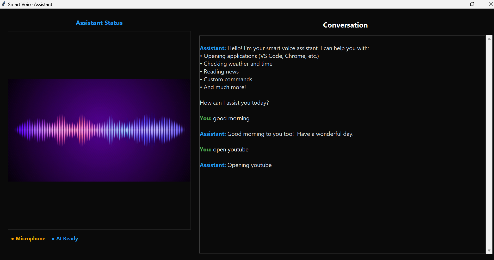

# Smart Voice Assistant

A Python-based voice assistant that can perform various tasks including opening applications, searching the web, and more.

## Screenshot


## Features

- Voice-controlled application launcher
- Web search functionality
- YouTube search
- System information display
- Modern GUI interface
- Support for multiple applications and web services

## Requirements

- Python 3.x
- Required Python packages:
  - tkinter
  - speech_recognition
  - pyttsx3
  - pyautogui
  - webbrowser
  - pillow
  - opencv-python
  - psutil

## Installation

1. Clone the repository:
```bash
git clone https://github.com/yourusername/smart_voice_assistant.git
cd smart_voice_assistant
```

2. Install the required packages:
```bash
pip install -r requirements.txt
```

## Usage

Run the application:
```bash
python gui.py
```

### Voice Commands

- "open [application name]" - Opens the specified application
- "search [query]" - Searches Google for the query
- "search youtube [query]" - Searches YouTube for the query
- "time" - Shows current time
- "weather" - Shows weather information
- "news" - Shows latest news headlines
- "exit" or "quit" - Closes the application

## Supported Applications

- Web Browsers (Chrome, Firefox, Edge)
- Development Tools (VS Code, Visual Studio, Sublime Text)
- System Applications (Notepad, Calculator, Paint, etc.)
- Microsoft Office Applications
- Media Applications
- System Tools
- Common Folders
- Web Applications (YouTube, Google, GitHub, etc.)

## Contributing

Feel free to submit issues and enhancement requests.

